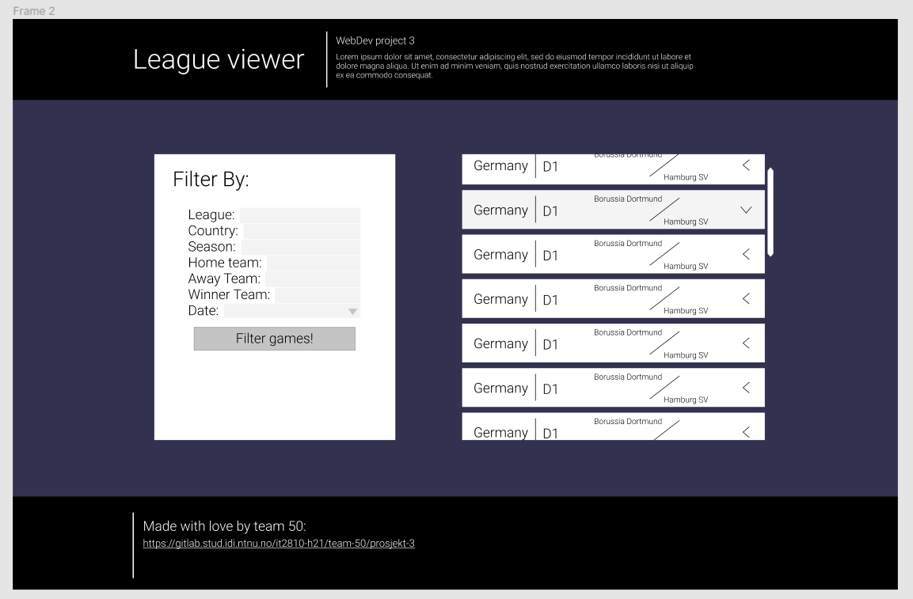
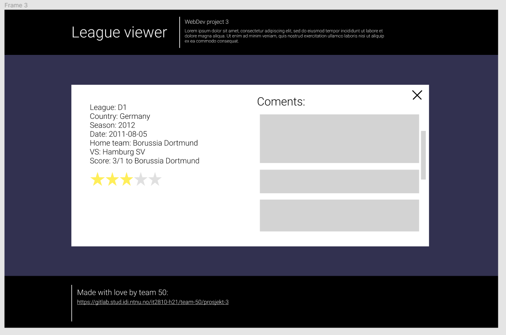

# Introduction

In this project the group sets out to create an application where the user can interact with a database containing football-match statistics. The user is allowed to filter, sort and search for specific matches. Moreover, the user can evaluate matches by giving stars and comments, and see how the feedback has been from other users.

# Problems

We encountered difficulties migrating project 3 to the Virtual Machine. The client in the virtual machine is not able to query the server, meanwhile the same client ran locally, is able to.   
The loading times for the data queries when the client is run locally are very slow.

# Setup

Go to the following link [http://it2810-50.idi.ntnu.no/prosjekt3/](http://it2810-50.idi.ntnu.no/prosjekt3/) to enjoy a nice presentation of your favorite football games!

The Apollo server and MongoDB database is running continuously on the Virtual Machine using the node-mode forever (https://www.npmjs.com/package/forever). Because of this there is no need to start the server locally. There have been some bugs in the deployment of the app on the VM so performance may improve by running the client locally.

# Run local client

Navigate to root and then first run `npm install`. When complete run `npm start`. This runs the app in the development mode.\
Open [http://localhost:3000](http://localhost:3000) to view it in the browser.

The page will reload if you make edits.\
You will also see any lint errors in the console.

This project was bootstrapped with [Create React App](https://github.com/facebook/create-react-app).

## Run remotely

Go to the following link [http://it2810-50.idi.ntnu.no/prosjekt3/](http://it2810-50.idi.ntnu.no/prosjekt3/) to enjoy a nice presentation of your favorite football games!

## Figma MockUp

Filter game list with diffrent string inputs or prefferably drop down menus.

View single game in popup to see comments and rating

https://www.figma.com/file/0fI2ua3Io3TU2zJQ9HhsZ1/Webdev-pro3?node-id=0%3A1

## Application layout

Snipped PNG of final application:

# Documentation

## Technology

The group has throughout the development process had an extensive focus on utilizing various third-party libraries. This has been done through an iterative process when implementing code, where the group find better and better solutions for widening the functionality of the application. The fact that the group has touched many different packages and libraries has given the members valuable insight to the ecosystem of React Web development.

### GraphQL

GraphQl is a query language for APIs enabling smooth and efficient interaction between client and server. The framework was initially concieved internally by Facebook, but is nowadays open-source hosted by the infamous Linux Foundation. GraphQL is typically denoted as a contrast to the established REST-framework and is getting more and more attention by the day. This is due to multiple factors; the nature of query statements removes the issues with excessive data responses, as only the data requested is retrieved. This gives more stable, fewer and predictable data responses.

In terms of this project, the group utilizes GraphQL extensively. Queries and mutations are used for interactions with the Apollo server. Resolvers and schemas are defined within the [server](./server) folder, defining which - and how - data fields can be populated.

### MongoDB

MongoDB was used to deploy the football-data on the Virtual Machine. A database with the name of football-data was created. Two collections made up the database. The first collection,`gamedata`, consisted of data from football matches from top european leagues. The second collection, `userdata`, consisted of user generated data in the form of ratings and comments related to each match. Mongoose was used to connect the Apollo server to the MongoDB database.

### Apollo

For interaction with the Apollo server the group utilizes the ApolloClient and ApolloProvider from the Apollo library, in addition to the Apollo Graph Plattform.
In the application the Apollo works as a stand-alone GraphQL server, which the application can make queries and mutations to. The resolvers responsible for populating data fields defined in the schema are defined in [resolvers.js](./server/resolvers.js)

### Chakra

Chakra UI is a modular and simple component library providing building blocks for React applications.

The group considers the usability of third-party UI packages very valuable, and Chakra UI is therefore used extensively throughout the application. This enables faster development and more beautiful styling. This can for instance be seen in the [Game](./src/components/gameComponents/Game.tsx) functional component which solely consists of Chakra UI components.

## Web accessibility

Aspects of web accessibility and universal design is demonstrated in this website.
We have explicitly added functionality so the user can press TAB to move between all fields and buttons on the webpage.
The games can be accessed when focused by tab and on pressing Enter, then closed the same way.
This way, none of the features of this site is uavailable without using the cursor.
(Tab Index and keyPress actions have been added to Game.tsx, solely to accomodate this feature.)

The text size scales with the zoom function in browsers like Chrome and Safari, making everything readable to those who needs larger text.
We have also chosen a clean and textbased design, users who have text read to them will have a parallell experience to those that read the screen themselves.

All search fields have also been describes explicitly to screen readers through the chackra ui component "VisuallyHidden", which describes what the user should do with that specific search field.

## Redux

We have used redux to store and pass the values of the search and filter function on our website.
The Filter passes the values in all field to our redux reducer with the action "UPDATE_SEARCH_DATA", which GameList.tsx listens to. The Query to our server is thereby automatically re-sent on any changes in these parameters.
We chose Redux over the availible Apollo Cache because it was usefull to learn a library as widely used as Redux.

## Context

We are using the Apollo client Context and cache to store any and all queries. If the user re-visits any page or Game-detail, the data will be retrieved from the local Apollo Cache, not the server.

## Design

The group agreed on a simple application design to facilitate more extensive focus on the functional parts of the application.

### Components

We are using the Chackra UI library throughout the application to easily and elegantly create all our components.
Examples are found in Comments.tsx, GameModal.tsx, Game.tsx, FilterBox.tsx and most all of our components.
