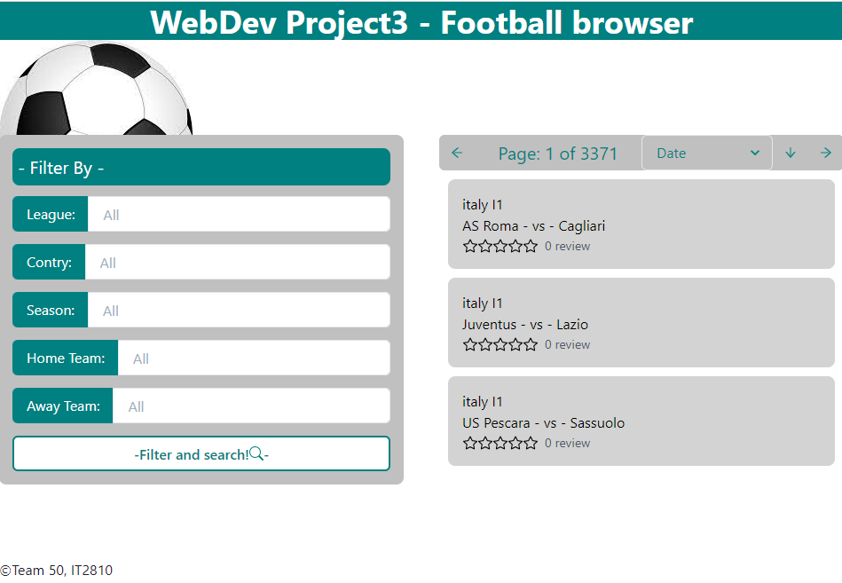

# Introduction

In this project the group sets out to create an application where the user can interact with a database containing football-match statistics. The user is allowed to filter, sort and search for specific matches. Moreover, the user can evaluate matches by giving stars and comments, and see how the feedback has been from other users.

# Problems

We encountered difficulties migrating project 3 to the Virtual Machine. The client in the virtual machine is not able to query the server, meanwhile the same client ran locally, is able to.   
The loading times for the data queries when the client is run locally are very slow.

# Setup

Go to the following link [http://it2810-50.idi.ntnu.no/prosjekt3/](http://it2810-50.idi.ntnu.no/prosjekt3/) to enjoy a nice presentation of your favorite football games!

The Apollo server and MongoDB database is running continuously on the Virtual Machine using the node-mode forever (https://www.npmjs.com/package/forever). Because of this there is no need to start the server locally. There have been some bugs in the deployment of the app on the VM so performance may improve by running the client locally.

# Run local client

Navigate to root and then first run `npm install`. When complete run `npm start`. This runs the app in the development mode.\
Open [http://localhost:3000](http://localhost:3000) to view it in the browser.

The page will reload if you make edits.\
You will also see any lint errors in the console.

This project was bootstrapped with [Create React App](https://github.com/facebook/create-react-app).

## Run remotely

Go to the following link [http://it2810-50.idi.ntnu.no/prosjekt3/](http://it2810-50.idi.ntnu.no/prosjekt3/) to enjoy a nice presentation of your favorite football games!

## Application layout

Snipped PNG of final application:


# Documentation

**Automated testing of React Typescript applications**
- In this project the group has worked on implementing systematic automated testing for backend and client from project 3. 

From the process of implementing tests, many improvents have been made as a result. (litt mer her.)

- Test location
- Setup and teardown
- Testing procedure (It)

**Test location**
Since unit tests work with specific components it makes sense to place them close to the components themselves. Because of this tests are places either one of two places:
1) The test is placed right next to the file it is testing.
```
src/
├─ App.tsx
├─ App.test.tsx
```
2) The test is place in a \_\_tests\_\_ folder in the same place as the component being tested.
```
gameComponents/
├─ Comments.tsx
├─ Game.tsx
├─ GameModal.tsx
├─ Rating.tsx
├─ __tests__/
│  ├─ Comments.test.tsx
│  ├─ Game.test.tsx
│  ├─ GameModal.test.tsx
│  ├─ Rating.test.tsx

```

**Setup and teardown**

A general framework is put in place to ensuring tests run independently of eachother. A test `container` is generated from scratch before each test contained in the file. The container is appended to the `document.body` and is ready for the test to use. After the test is done the container is removed from the document body, and set to `container = null` in preparation for the next test. The code is shown in the code block below.

```
beforeEach(() => {
  container = document.createElement("div");
  document.body.appendChild(container);
});

afterEach(() => {
  document.body.removeChild(container);
  container = null;
});
```

## Testing procedure
Three steps are performed for every unit test.
1) Generate test-data
2) Render components
3) Make assertions

Test-data is first generated and structured, for example in a `JSON` object. Then, the component rendered using the `ReactDOM.render()` method. Finally assertions are made using the `jest` library, with `expect()` being used for normal assertions while `jest.fn()` is used for spies. The general flow is illustrated in the code block below.

```
it("has a descriptive name for what is tested",  () => {
    // 1) Generate test-data
    act( () => {
        // 2) render component
    }
    // 3) make assertions
    )
}
```

### Generate test-data
Test-data is generated at the start of every test.

### Render components
### Make assertions

in the file it make sense to put them close to the 

"smoke test"

- React unit testing og Jest
    - BeforeEach and AfterEach.
    - Test modularity (each test being separate from others)
    - Describe, it, act, ReactDOM.render(), expect(), container elements, 
    - dispatchEvent
    - jest.fn() for checking method calls
    - Snapshots
    
- Apollo-server-mockings
    - MockedProvider, Mocks, 

- #Cypress end-to-end testing
Cypress is an end-to-end testing framework for web test automation which we have used to write automated web tests for the Football Browser application.

Using cypress and end-2-end testing every common usecase of the application has been tested.
The integration tests we have written covers the following:
    - Turing pages
    - Filtering
    - Searching
    - Sorting
    - Commenting
    - Rating
    
 we 
    22

    - beforeEach -> cy.intercept -> cy.visit
    - cy.get -> cy.wait -> cy.expect
    - cy.contains
    - 


## Technology

The group has throughout the development process had an extensive focus on utilizing various third-party libraries. This has been done through an iterative process when implementing code, where the group find better and better solutions for widening the functionality of the application. The fact that the group has touched many different packages and libraries has given the members valuable insight to the ecosystem of React Web development.

### GraphQL

GraphQl is a query language for APIs enabling smooth and efficient interaction between client and server. The framework was initially concieved internally by Facebook, but is nowadays open-source hosted by the infamous Linux Foundation. GraphQL is typically denoted as a contrast to the established REST-framework and is getting more and more attention by the day. This is due to multiple factors; the nature of query statements removes the issues with excessive data responses, as only the data requested is retrieved. This gives more stable, fewer and predictable data responses.

In terms of this project, the group utilizes GraphQL extensively. Queries and mutations are used for interactions with the Apollo server. Resolvers and schemas are defined within the [server](./server) folder, defining which - and how - data fields can be populated.

### MongoDB

MongoDB was used to deploy the football-data on the Virtual Machine. A database with the name of football-data was created. Two collections made up the database. The first collection,`gamedata`, consisted of data from football matches from top european leagues. The second collection, `userdata`, consisted of user generated data in the form of ratings and comments related to each match. Mongoose was used to connect the Apollo server to the MongoDB database.

### Apollo

For interaction with the Apollo server the group utilizes the ApolloClient and ApolloProvider from the Apollo library, in addition to the Apollo Graph Plattform.
In the application the Apollo works as a stand-alone GraphQL server, which the application can make queries and mutations to. The resolvers responsible for populating data fields defined in the schema are defined in [resolvers.js](./server/resolvers.js)

### Chakra

Chakra UI is a modular and simple component library providing building blocks for React applications.

The group considers the usability of third-party UI packages very valuable, and Chakra UI is therefore used extensively throughout the application. This enables faster development and more beautiful styling. This can for instance be seen in the [Game](./src/components/gameComponents/Game.tsx) functional component which solely consists of Chakra UI components.

## Redux

We have used redux to store and pass the values of the search and filter function on our website.
The Filter passes the values in all field to our redux reducer with the action "UPDATE_SEARCH_DATA", which GameList.tsx listens to. The Query to our server is thereby automatically re-sent on any changes in these parameters.
We chose Redux over the availible Apollo Cache because it was usefull to learn a library as widely used as Redux.


# File tree

TODO: Add a file tree here after everything is done.
```bash
src/
┣ apolloExample/
┃ ┣ ApolloExample.tsx
┃ ┗ ExchangeRates.tsx
┣ components/
┃ ┣ containerComponents/
┃ ┃ ┣ __tests__/
┃ ┃ ┃ ┣ __snapshots__/
┃ ┃ ┃ ┃ ┣ Footer.test.tsx.snap
┃ ┃ ┃ ┃ ┗ Header.test.tsx.snap
┃ ┃ ┃ ┣ Content.test.tsx
┃ ┃ ┃ ┣ Footer.test.tsx
┃ ┃ ┃ ┗ Header.test.tsx
┃ ┃ ┣ Content.tsx
┃ ┃ ┣ Footer.tsx
┃ ┃ ┗ Header.tsx
┃ ┣ gameComponents/
┃ ┃ ┣ Comments.tsx
┃ ┃ ┣ Game.tsx
┃ ┃ ┣ GameModal.tsx
┃ ┃ ┗ Rating.tsx
┃ ┣ queryComponents/
┃ ┃ ┗ GamesList.tsx
┃ ┣ sortingComponents/
┃ ┃ ┣ FilterBox.tsx
┃ ┃ ┣ PageChanger.tsx
┃ ┃ ┗ SearchBar.tsx
┃ ┗ style.css
┣ redux/
┃ ┣ searchFilter/
┃ ┃ ┣ filterSearchReducer.ts
┃ ┃ ┗ searchFilterTypes.ts
┃ ┣ index.ts
┃ ┗ StateType.ts
┣ resources/
┃ ┣ football.jpg
┃ ┣ gitlab-icon.png
┃ ┗ react-icon.png
┣ App.css
┣ App.test.tsx
┣ App.tsx
┣ e2e.test.tsx
┣ index.css
┣ index.tsx
┣ logo.svg
┣ react-app-env.d.ts
┣ reportWebVitals.ts
┗ setupTests.ts
```
